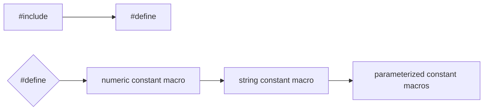
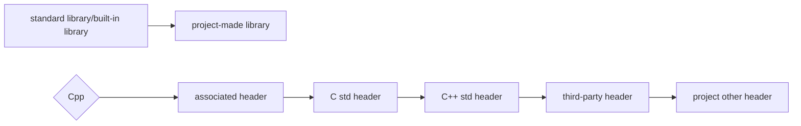

##### English | [简体中文](https://github.com/ODCLAB/ODCSTD/blob/main/zh-cn/源码排版.md)

## ✒Name

***prefix + main name + suffix***

> Example using `cpp`, applicable to any programming language or refer it.

### Main Name

<table>
	<tr>
    	<th>Pascal-Case</th>
        <td>class(self & function pointer type member & method), struct(self & function pointer type member), union(self & function pointer type member), namespace, enum, function</td>
    </tr>    
    <tr>
    	<th>Camel-Case</th>
        <td>class(normal member), struct(normal member), union(normal member), var, parameter, object</td>
    </tr>
    <tr>
    	<th>Capitalize the First Letter with Google-Style</th>
        <td>macro, constant, enum<br/><code>#define CONSTANT_VALUE</code></td>
    </tr>	
</table>


- Hungarian notation for main names related to Windows APIs.

<table>
	<tr>
		<th>Prefix</th>
		<th>Mean</th>
	</tr>
    <tr>
    	<td>a</td>
        <td>array</td>
    </tr>
    <tr>
    	<td>b</td>
        <td>boolean</td>
    </tr>
    <tr>
    	<td>by</td>
        <td>unsigned char(byte)</td>
    </tr>
    <tr>
    	<td>c</td>
        <td>char</td>
    </tr>
    <tr>
    	<td>ch</td>
        <td>tchar</td>
    </tr>
    <tr>
    	<td>cb</td>
        <td>cout of bytes</td>
    </tr>
    <tr>
    	<td>f</td>
        <td>flags（usually multiple bit values）</td>
    </tr>
    <tr>
    	<td>fn</td>
        <td>function</td>
    </tr>
    <tr>
    	<td>h</td>
        <td>handle</td>
    </tr>
    <tr>
    	<td>i</td>
        <td>integer</td>
    </tr>
     <tr>
    	<td>n</td>
        <td>short int</td>
    </tr>
    <tr>
    	<td>l</td>
        <td>long</td>
    </tr>
        <tr>
    	<td>u</td>
        <td>unsigned int</td>
    </tr>
    <tr>
    	<td>ul</td>
        <td>unsigned long</td>
    </tr>
    <tr>
    	<td>w</td>
        <td>WORD(unsigned short)</td>
    </tr>
    <tr>
    	<td>dw</td>
        <td>DWORD（unsigned long）</td>
    </tr>
    <tr>
    	<td>p</td>
        <td>pointer</td>
    </tr>
    <tr>
    	<td>lp</td>
        <td>long pointer</td>
    </tr>
    <tr>
    	<td>s</td>
        <td>string</td>
    </tr>
    <tr>
    	<td>sz</td>
        <td>zero terminated string</td>
    </tr>
    <tr>
    	<td>tm</td>
        <td>text metric</td>
    </tr>
    <tr>
    	<td>x, y...</td>
        <td>coordinates（short）</td>
    </tr>
    <tr>
    	<td>v</td>
        <td>void</td>
    </tr>
</table>


- By default, the loop var uses `i`, `j`, `k`

### Suffix

- Same Body Different Type

    After main name, `-` followed by a suffix.

    | Types  | Suffix  |
    | ------ | ------- |
    | int    | _int    |
    | char   | _char   |
    | float  | _float  |
    | double | _double |
    | string | _str    |
    | point  | _p      |

- Same Body Different Status

    After main name, `-`  is followed by the status.

    ```cpp
    int repository;
    int repository_lock;
    ```

### Prefix

<table>
    <tr>
        <th>Gobol</th>
        <td><code>int g_name;</code></td>
    </tr>
    <tr>
        <th>Static</th>
        <td><code>int s_name</code></td>
</table>

- Class

    ```cpp
    class C_Class{
        int m_member; //normal member
        void (*m_Member);
        ...
    
        void Function{
            ...
        } //method
            ...
    }
    ```

- Struct

    ```cpp
    struct S_Struct{
        ...
    }
    ```

- Union

    ```cpp
    union U_Union{
        ...
    }
    ```

- Namespace

    ```cpp
    namespace N_Namespace{
        ...
    }
    ```

- Enum

    ```cpp
    enum E_Enum{
        ...
    }
    ```

- Function

    ```cpp
    void Funtion{
        ...
    }
    ```

- Var

    ```cpp
    int var;
    // Abbreviation：
    int id; //Act as first word in all lowercase.
    int varID; //Do not act as the first word in all caps.
    ```


## 💾Preprocessing




## 📗Import



## 🏗️Construct

- Function

  <table>
      <tr>
          <th>Input-type Param</th>
          <td><code>const</code> as declaration prefix</td>
      </tr>
      <tr>
          <th>Output-type Param</th>
          <td>use references instead of pointers whenever possible</td>
      </tr>
  </table>
  
  For input-type pointer action param:
  
  ```cpp
  void Function(const int &param){
      ...
      const_cast<int &>(param)...
      ...
  }
  ```
  
  

## 💬Comment

| Right Side                                      | Above Side                              |
| ----------------------------------------------- | --------------------------------------- |
| Single line of code (with one space in between) | Code block (leave a line after the end) |

```cpp
/* Top-level header independent comments */
/* * First-level subtitle independent comments */

/* Single line of code */
int var; //This is a var of type int.

/* Code block */
int function(){
    //Count the number of for loops.
    int loop = 0;
    for(int i=0;i<6;i++){
    	loop ++;    
    }
    
    int reLoop = 0;
    loop = reLoop;
}
```

- Comments are only in English. 

- When you find that you need to be excluded or there are hidden dangers in the code, if you do not solve it immediately, you should immediately mark the `TODO:` comment next to the code.

    ```cpp
    void GetStates(char* users,char* operatingSystem="Windows10"); \\TODO:param<operatingSystem>:Must be devepended on users devices, maybe need to construct a function to judge the users operating system.
    ```

- If the third-party library contained in the referenced library is required in the main source code, then a comment declaration is required in the main source code, immediately after the `#include` section.

    ```cpp
    /* header.hpp */
    #include <iostream>
    
    #include "lib/Library.lib"
    
    #pragma comment(lib,"Lib/Library.lib")
    ```
    
    ```cpp
    /* main.cpp */
    #include "./header.hpp"
    
    /*
    #include <iostream>
    
    #include "lib/Library.lib"
    
    #pragra comment(lib,"Lib/Library.lib")
    */
    
    int main(){
        std::cout << "Hello world!" << std::endl;
        return 0;
    }
    ```

