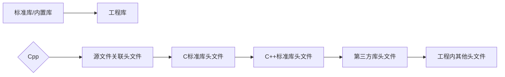

##### [English](../en-us/code_layout.md) | 简体中文

## ✒命名

**前缀 + 主名称 + 后缀**

> 使用`cpp`举例，适用于或参考任何编程语言

### 主名称

<table>
	<tr>
    	<th>大驼峰</th>
        <td>类（成员和方法）、结构体、共用体、命名空间、枚举、函数</td>
    </tr>    
    <tr>
    	<th>小驼峰</th>
        <td>变量、参数、对象</td>
    </tr>
    <tr>
    	<th>全大写谷歌风格</th>
        <td>常量<br/><code>#define CONSTANT_VALUE</code></td>
    </tr>	
</table>

### 后缀

- 同体不同类型

    名称后`-`接后缀

    | 类型   | 后缀    |
    | ------ | ------- |
    | int    | _int    |
    | char   | _char   |
    | float  | _float  |
    | double | _double |
    | string | _str    |
    | point  | _p      |

- 同体不同状态

    名称后`-`接状态

    ```cpp
    int repository;
    int repository_lock;
    ```

### 前缀

- 类

    ```cpp
    class C_Class{
        int m_Member; //成员
        ...
            
        void Function{
            ...
        } //方法
            ...
    }
    ```

- 结构体

    ```cpp
    struct S_Struct{
        ...
    }
    ```

- 共用体

    ```cpp
    union U_Union{
        ...
    }
    ```

- 命名空间

    ```cpp
    namespace N_Namespace{
        ...
    }
    ```

- 枚举

    ```cpp
    enum E_Enum{
        ...
    }
    ```

- 函数

    ```cpp
    void Funtion{
        ...
    }
    ```

- 对象

    <table>
        <tr>
            <th>类</th>
            <td><code>C_Class c_object;</code></td>
        </tr>
        <tr>
            <th>结构体</th>
            <td><code>S_Struct s_object;</code></td>
        </tr>
        <tr>
            <th>共用体</th>
            <td><code>U_Union u_object;</code></td>
        </tr>
        <tr>
            <th>枚举</th>
            <td><code>E_Enum e_object;</code></td>
        </tr>
    </table>
    
- 变量

    ```cpp
    int var;
    // 缩写：
    int id; //充当首个单词全小写
    int varID; //不充当首个单词全大写
    ```

    <table>
        <tr>
            <th>全局</th>
            <td><code>int g_var;</code></td>
        </tr>
    </table>


## 📗引用



## 💬注释

- 注释唯一使用英语

- 注释符号和代码之间要留一空

- 发现需作情况排除或有代码隐患时，如不马上解决要立刻在代码旁标注`TODO:`注释

    ```cpp
    void GetStates(char* users,char* operatingSystem="Windows10"); \\TODO:param<operatingSystem>:Must be devepended on users devices, maybe need to construct a function to judge the users operating system.
    ```

- 如果引用的库所包含的第三方库在主源代码中是必需的，那么需要在主源代码中进行注释声明

    ```cpp
    //header.hpp
    #include <iostream>
    ```

    ```cpp
    //main.cpp
    #include "./header.hpp"
    
    /*
    #include <iostream>
    */
    
    int main(){
        std::cout << "Hello world!" << std::endl;
        return 0;
    }
    ```
