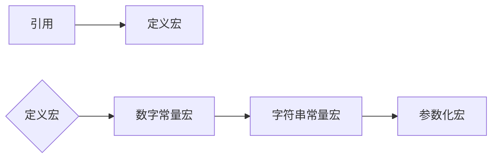
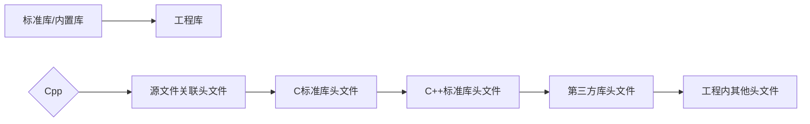

##### [English](https://github.com/ODCLAB/ODCSTD/blob/main/en-us/code_layout.md) | 简体中文

## ✒命名

**前缀 + 主名称 + 后缀**

> 使用`cpp`举例，适用于或参考任何编程语言

### 主名称

<table>
	<tr>
    	<th>大驼峰</th>
        <td>类（类，函数指针型成员，方法）、结构体（结构体，函数指针型成员）、共用体（共用体，函数指针型成员）、命名空间、枚举、函数</td>
    </tr>    
    <tr>
    	<th>小驼峰</th>
        <td>类（变量型成员）、结构体（变量型成员）、共用体（变量型成员）、变量、参数、对象</td>
    </tr>
    <tr>
    	<th>全大写谷歌风格</th>
        <td>宏、常量、枚举<br/><code>#define CONSTANT_VALUE</code></td>
    </tr>	
</table>


- 与Windows API有关主名称采用匈牙利

<table>
	<tr>
		<th>前缀</th>
		<th>意义</th>
	</tr>
    <tr>
    	<td>a</td>
        <td>数组</td>
    </tr>
    <tr>
    	<td>b</td>
        <td>布尔值</td>
    </tr>
    <tr>
    	<td>by</td>
        <td>无符号字符</td>
    </tr>
    <tr>
    	<td>c</td>
        <td>字符</td>
    </tr>
    <tr>
    	<td>ch</td>
        <td>8位或16位Unicode字符</td>
    </tr>
    <tr>
    	<td>cb</td>
        <td>字节数</td>
    </tr>
    <tr>
    	<td>f</td>
        <td>标志（一般是有多位的数值）</td>
    </tr>
    <tr>
    	<td>fn</td>
        <td>函数</td>
    </tr>
    <tr>
    	<td>h</td>
        <td>句柄</td>
    </tr>
    <tr>
    	<td>i</td>
        <td>整数</td>
    </tr>
     <tr>
    	<td>n</td>
        <td>短整数</td>
    </tr>
    <tr>
    	<td>l</td>
        <td>长整数</td>
    </tr>
        <tr>
    	<td>u</td>
        <td>无符号整数</td>
    </tr>
    <tr>
    	<td>ul</td>
        <td>无符号长整数</td>
    </tr>
    <tr>
    	<td>w</td>
        <td>无符号短整数</td>
    </tr>
    <tr>
    	<td>dw</td>
        <td>双字（无符号长整数）</td>
    </tr>
    <tr>
    	<td>p</td>
        <td>指针</td>
    </tr>
    <tr>
    	<td>lp</td>
        <td>长指针</td>
    </tr>
    <tr>
    	<td>s</td>
        <td>字符串</td>
    </tr>
    <tr>
    	<td>sz</td>
        <td>以'\0'结尾的字符串</td>
    </tr>
    <tr>
    	<td>tm</td>
        <td>文本规则</td>
    </tr>
    <tr>
    	<td>x, y...</td>
        <td>坐标值（短整数）</td>
    </tr>
    <tr>
    	<td>v</td>
        <td>空</td>
    </tr>
</table>

- 循环变量默认情况下使用`i`，`j`，`k`

### 后缀

- 同体不同类型

    名称后`-`接后缀

    | 类型   | 后缀    |
    | ------ | ------- |
    | int    | _int    |
    | char   | _char   |
    | float  | _float  |
    | double | _double |
    | string | _str    |
    | point  | _p      |

- 同体不同状态

    名称后`-`接状态

    ```cpp
    int repository;
    int repository_lock;
    ```

### 前缀

<table>
    <tr>
        <th>全局</th>
        <td><code>int g_name;</code></td>
    </tr>
    <tr>
    	<th>静态</th>
        <td><code>int s_name;</code></td>
    </tr>
</table>

- 类

    ```cpp
    class C_Class{
        int m_member; //变量型成员
        void (*m_Member)() //函数指针型成员
        ...
            
        void Function{
            ...
        } //方法
            ...
    }
    ```

- 结构体

    ```cpp
    struct S_Struct{
        ...
    }
    ```

- 共用体

    ```cpp
    union U_Union{
        ...
    }
    ```

- 命名空间

    ```cpp
    namespace N_Namespace{
        ...
    }
    ```

- 枚举

    ```cpp
    enum E_Enum{
        ...
    }
    ```

- 函数

    ```cpp
    void Funtion{
        ...
    }
    ```

- 变量

    ```cpp
    int var;
    // 缩写：
    int id; //充当首个单词全小写
    int varID; //不充当首个单词全大写
    ```


## 💾预处理




## 📗引用




## 🏗️构造

非分享代码的源文件不需要关联的头文件

<table>
    <tr>
        <th>输入型参数</th>
        <td><code>const</code>作声明前缀</td>
    </tr>
    <tr>
        <th>输出型参数</th>
        <td>尽量用引用代替指针</td>
    </tr>
</table>
- 输入型指针作用参数

  ```cpp
  void Function(const int &param){
      ...
   	  const_cast<int &>(param)... //write
        param... /read-only
      ...
  }
  ```
  
- 完全输出型参数

  ```cpp
  void Function(int &param){
      ...
  }
  ```


- 可选输出型参数

  ```cpp
  void Function(int *param = NULL){
      ...
  }
  ```

  

## 💬注释

| 右方                 | 上方                                   |
| -------------------- | -------------------------------------- |
| 单代码行（间隔一空） | 代码块（如结尾后无明显间隔，需留一行） |

```cpp
/* 顶级标题独立注释 */
/* * 一级子标题独立注释 */

/* 单代码行 */
int var; //This is a var of type int.

/* 代码块 */
int function(){
    //Count the number of for loops.
    int loop = 0;
    for(int i=0;i<6;i++){
    	loop ++;    
    }
    
    int reLoop = 0;
    loop = reLoop;
}
```

- 注释唯一使用英语

- 发现需作情况排除或有代码隐患时，如不马上解决要立刻在代码旁标注`TODO:`注释

    ```cpp
    void GetStates(char* users,char* operatingSystem="Windows10"); \\TODO:param<operatingSystem>:Must be devepended on users devices, maybe need to construct a function to judge the users operating system.
    ```

- 如果引用的库所包含的第三方库在主源代码中是必需的，那么需要在主源代码中进行注释声明，紧接在`#include`部分后

    ```cpp
    /* header.hpp */
    #include <iostream>
    
    #include "lib/Library.lib"
    
    #pragma comment(lib,"Lib/Library.lib")
    ```
    
    ```cpp
    /* main.cpp 
    #include "./header.hpp"
    
    /*
    #include <iostream>
    
    #include "lib/Library.lib"
    
    #pragra comment(lib,"Lib/Library.lib")
    */
    
    int main(){
        std::cout << "Hello world!" << std::endl;
        return 0;
    }
    ```
